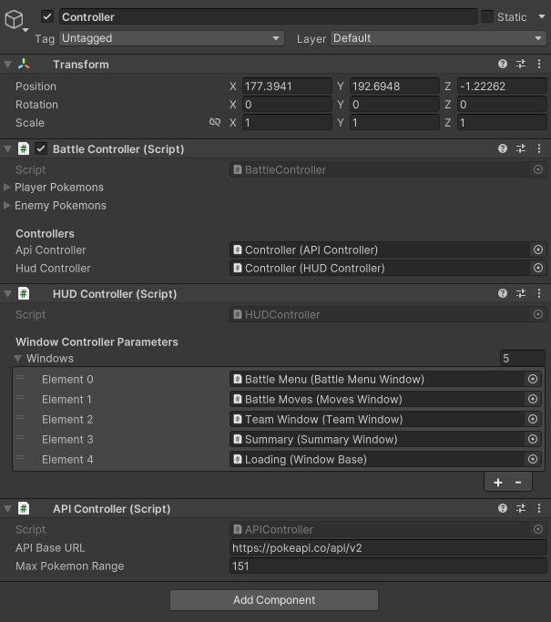

# 🧩 Sistema de Batalha Pokémon com PokeAPI (Unity) | Pokémon Battle System with PokeAPI (Unity)

Este projeto é um sistema de batalha Pokémon desenvolvido em **Unity**, com integração à **[PokeAPI](https://pokeapi.co)** para carregamento de dados reais dos Pokémon (sprites, movimentos, tipos, etc.).

This is a Pokémon battle system built with **Unity**, integrated with the **[PokeAPI](https://pokeapi.co)** to fetch real Pokémon data such as sprites, moves, types, and stats.

---

## 🔥 Funcionalidades | Features

- Geração de times aleatórios com 6 Pokémon para cada lado  
  Random team generation with 6 Pokémon per side

- Carregamento de sprites via URL com retry automático (erros 429)  
  Sprite loading via URL with retry support (handles 429 errors)

- HUD com informações de vida, nível, nome e tipos  
  HUD showing HP, level, name, and types

- Consulta de dados detalhados de movimentos  
  Detailed move data fetching

- Interface dinâmica com botões, eventos e janelas  
  Interactive UI with buttons, events, and dynamic windows

---

## 🎯 Objetivo | Purpose

Demonstrar como integrar uma API externa em um projeto Unity, utilizando boas práticas de organização de código, manipulação de dados assíncronos e atualização de interface de usuário em tempo real.

Showcase how to integrate an external API into a Unity project using best practices for code organization, asynchronous data handling, and real-time UI updates.

---

## 🖼️ Capturas de Tela | Screenshots

### 🎮 Estrutura Central do Sistema

<p align="center">
  
</p>

🔧 Esta imagem mostra o **objeto principal que centraliza o controle da batalha**.  
O `BattleController` é responsável por armazenar as referências para os demais controladores (HUD, API, Belt, etc).

- Para aumentar o número máximo de Pokémon possíveis, altere o valor de `MaxPokemonRange` no `APIController`.
- Para adicionar novas janelas de interface, insira-as manualmente no array `Windows` dentro do `HUDController`.

---

## 🌐 Versão Web

Jogue online no Itch.io:  
👉 [https://romulo1209.itch.io/pokmon-battle-system-with-pokeapi-unity](https://romulo1209.itch.io/pokmon-battle-system-with-pokeapi-unity)

---

## 📌 Requisitos | Requirements

- Unity 2021.3 ou superior  
  Unity 2021.3 or newer

- Conexão com a internet para acessar a PokéAPI  
  Internet connection to access PokeAPI

---

## 📫 Contato | Contact

Desenvolvido por **Romulo José Henrique**  
Developed by **Romulo José Henrique**

📧 romulojosehenrique@outlook.com  
🐙 GitHub: [@Romulo1209](https://github.com/Romulo1209)

---

## 📝 Licença | License

Este projeto está licenciado sob a [MIT License](LICENSE).  
This project is licensed under the [MIT License](LICENSE).

---

## 📁 Localização do Projeto | Project Location

O projeto Unity está contido na pasta:

```bash
Project/
